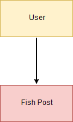
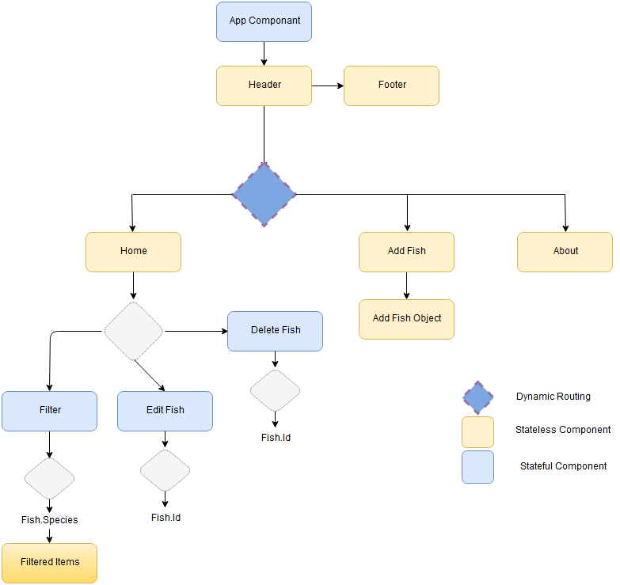
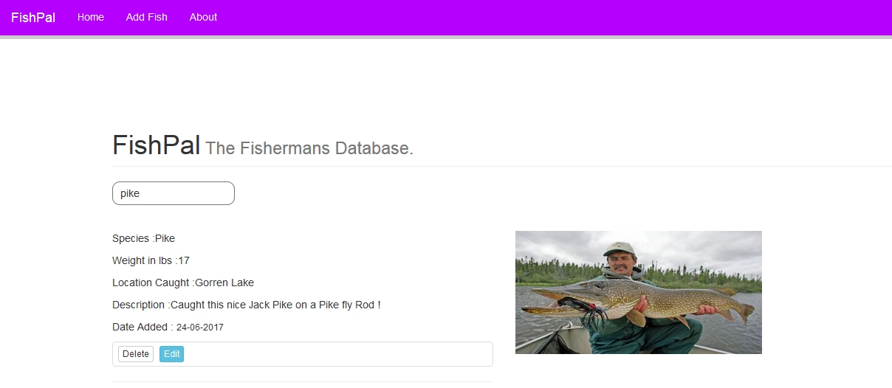
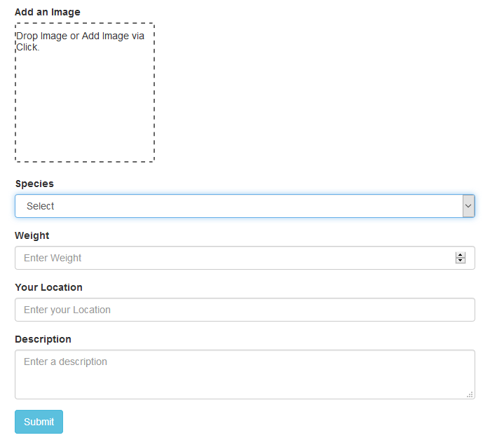
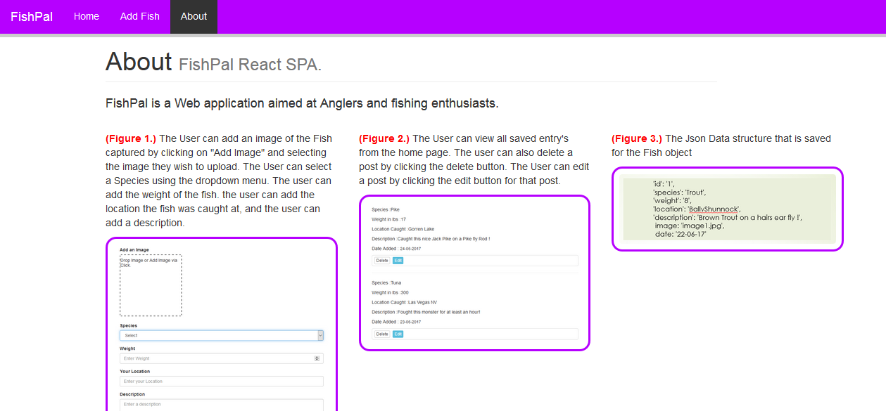

# Assignment 1 - ReactJS App - FishPal 
Brendan Smith (20061961)

## Overview

This application is a requirement for the Software Frameworks module of semester two, year four of the B.Sc. in Software Systems Development course at Waterford Institute of Technology. It aims to allow Anglers or fishing enthusiasts to record and post data related to each fish that they have caught.

Features:
+ Add Data on fish caught
    - Add Image
    - Add Species
    - Add Weight
    - Location
    - Description

+ Display all saved data in the browser for viewing
+ Search through saved entry's by species or location
+ Delete saved entrys
+ Edit saved entrys

## Installation requirements

List of software used to develop the app:

+ ReactJS v15.3.0

+ Bootstrap 3

+ create-react-app tool

+ Sublime Text editor

+ Firefox browser using React Developers Tools

Once the project files have been cloned or downloaded launch a command terminal from the project root folder, install 'npm' by entering 'npm install', then launch the server with the command 'npm start'. The default browser will launch a new window/tab accessing localhost:3000, displaying the react project.

## Data Model Design

The data model for my application is User and Post
  

## App Component Design

  

  

## UI Design

Below are screenshots of the applications pages
  
 Home page

  
 Add Fish page

  
About page

  

## Routing

This project contains three routes which are home (/), addfish (/addfish), and about (/about). 
Routing is implemented using the react-router npm module.
The home route is set as the index route which will load whenever '/' is called.

  

## Independent learning

To add images to posts i had to learn how to implement saving images to Cloudinary using react-dropzone and superagent in the project. It was also necessary to learn about 'localStorage' in order to save fish entered by the user to their local memory. 